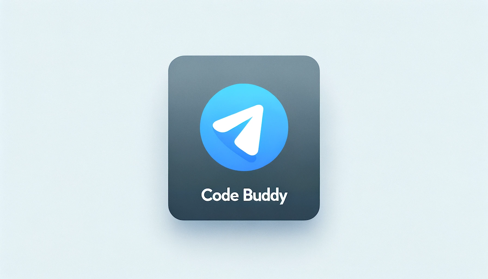

<h1 align="center"> Code Buddy: Telegram bot with OpenAI API  </h1> <br>
<p align="center">
  <a href="https://gitpoint.co/">
    
  </a>
</p>

<p align="center">
  CodeBuddy, is designed to challenge users with coding tasks in telegram bot. 
</p>


## Table of Contents

- [Introduction](#introduction)
- [Features](#features)
- [Feedback](#feedback)
- [Build Process](#build-process)


## Introduction

[]()
[]()
[]()

Code Buddy is a Telegram bot that integrates OpenAI's powerful API to provide users with engaging and challenging coding tasks. This bot is an excellent tool for developers looking to hone their coding skills through interactive tasks and AI-driven feedback.

**Available in telegram, just insert your API's.**

<p align="center">
  
</p>

## Features

A few of the things you can do with CodeBuddy:

Code Buddy offers a range of functionalities, including:

* Generation of coding tasks of varying difficulty levels.
* Interactive feedback on code submissions.
* An intuitive interface for seamless interaction.
* Comprehensive support for various programming languages.
* The support of different OpenAI models

## Feedback

Feel free to send any feedback or ideas

[](www.telegram.com/ttimfey)
## Build Process


This document provides a comprehensive guide for setting up the Code-Buddy application. Please follow the steps in sequence for an optimal installation experience.

1. **Repository Cloning**

   Begin by cloning the repository using the following Git command:

    ```bash
    git clone https://github.com/tymmko/telegram-code-buddy
    ```

2. **Configuration Adjustment**

    Navigate to the `configuration/config.yml` file and update the API tokens as per your requirements.

3. **Package Installation**

    Execute the following command to install all necessary packages:

    ```bash
    pip install -r requirements.txt
    ```

4. **Application Initialization**
    
    To start the application, run:
    ```bash
    python3 TelegramBot_handler.py
    ```

Thank you for your attention to my project. Have fun!

MIT Licence
